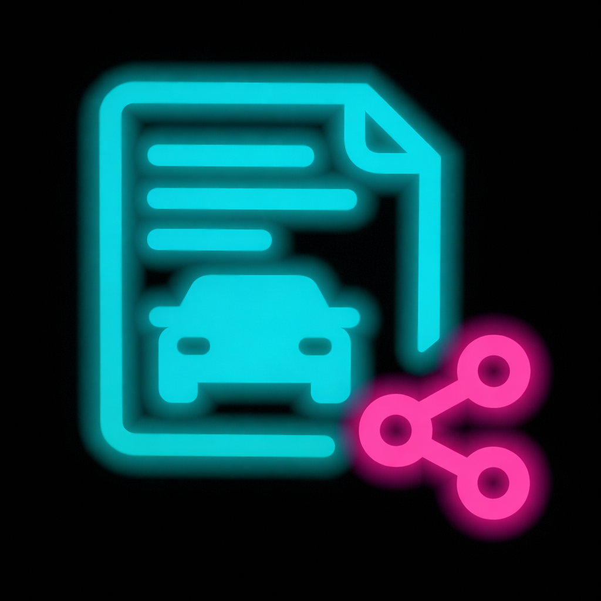
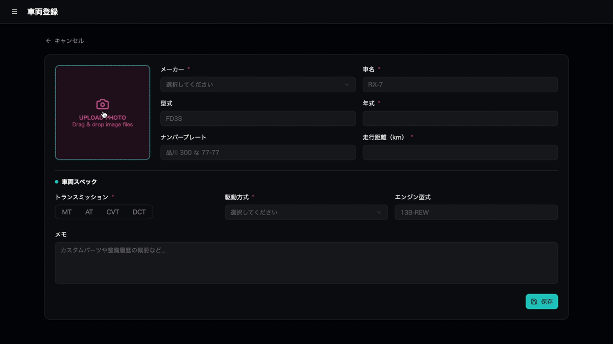
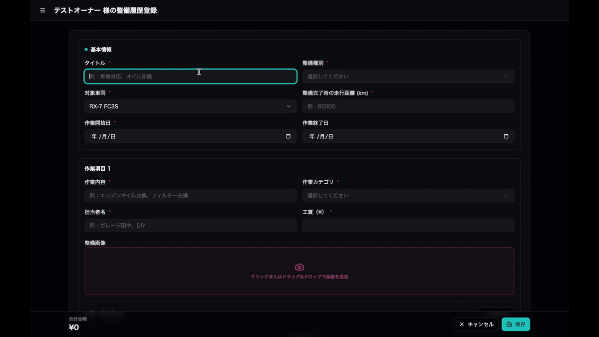
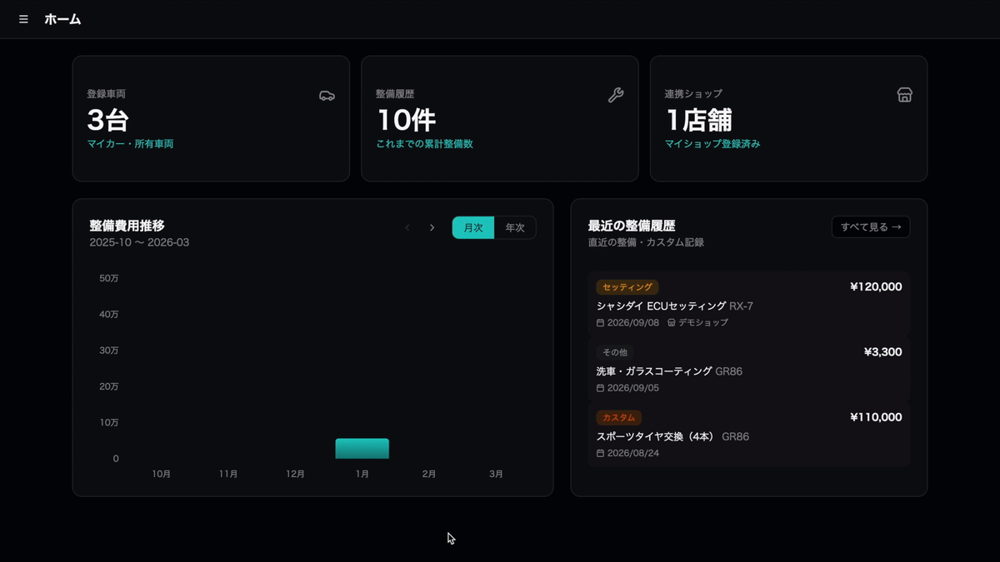
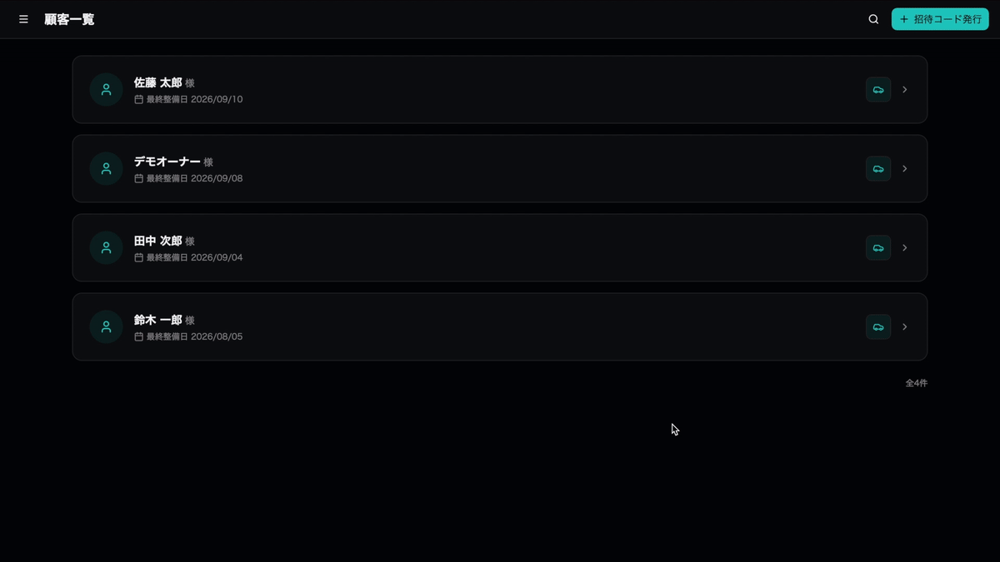
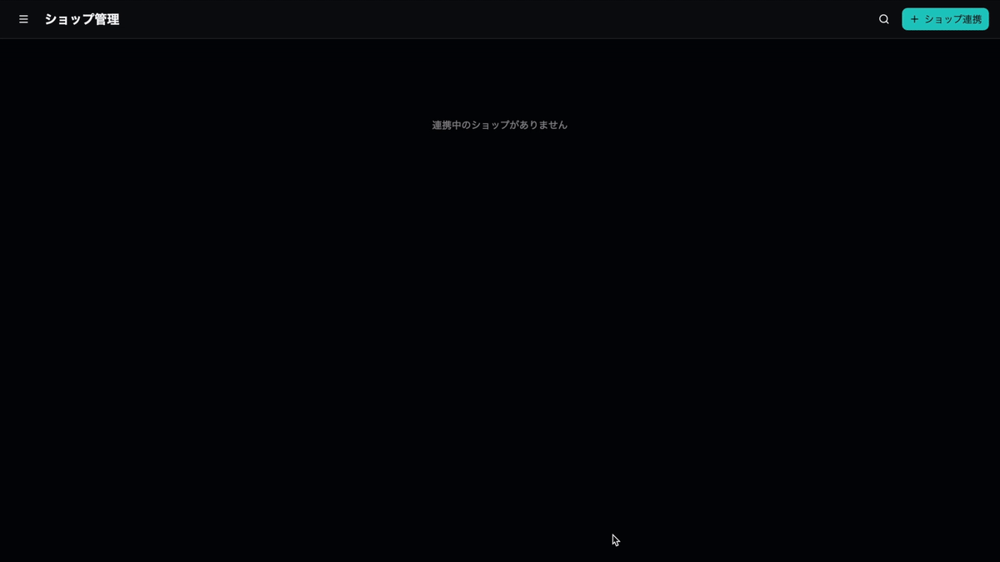
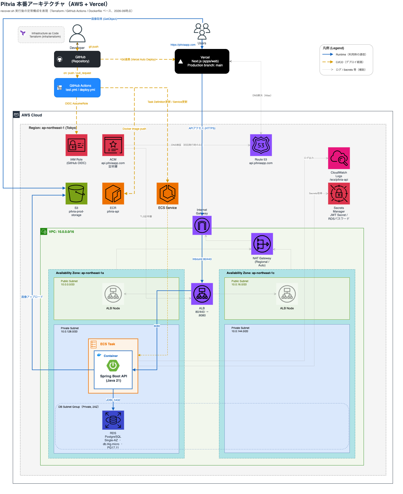
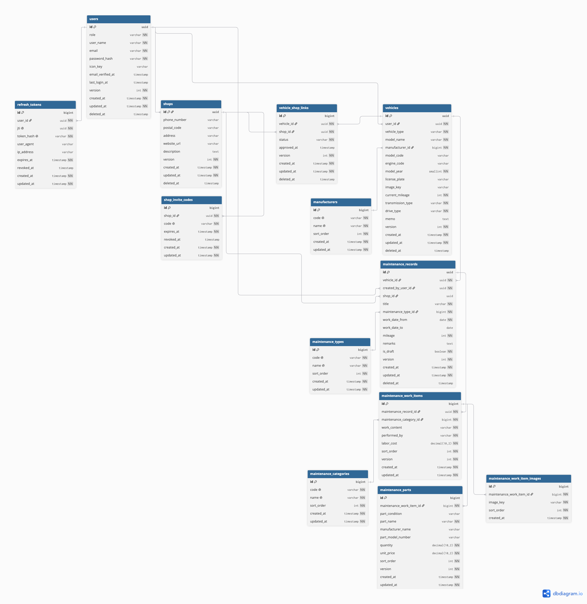

<h1>
  
  Pitvia
</h1>

**走るクルマのための整備記録・ショップ連携アプリ**

Pitvia は、スポーツカー・旧車・カスタムカーオーナー向けに、
整備履歴・ショップ連携を一元管理できる Web アプリケーションです。

一般的な整備記録アプリが「日常メンテナンス管理」を主軸とする中、
Pitvia は **🏎️ 走る楽しさ・🔧 維持する楽しさ・📊 育てる楽しさ** にフォーカスしたサービスを目指します。

🌐 **Production:** https://pitviaapp.com

> [!WARNING]
>
> ### 本番環境について
>
> β版ではAWSコスト削減のため、必要時のみTerraformで再構築しています。
> そのため、タイミングによっては停止している場合があります。

🔑 **Demo Account**
| Role | Email | Password |
|---|---|---|
| OWNER | demo-owner@example.com | `password123` |
| SHOP | demo-shop@example.com | `password123` |

---

# 開発背景

既存の整備管理は、以下のような課題があります。

- 整備履歴が紙・Excel・口頭で管理されている
- オーナーとショップで履歴共有しづらい
- カスタム履歴が残らない
- 維持費が見えづらい

また、スポーツカー・旧車オーナーには、

- 一般車と異なる交換サイクル
- チューニング履歴管理
- 弱点部位の予防整備
- 専門ショップとの継続的な関係

といった独自ニーズがあります。

Pitvia は、そうしたユーザー向けに設計されたサービスです。

---

# 想定ユーザー

## 👤 オーナー（一般ユーザー）

- スポーツカーオーナー
- 旧車オーナー
- サーキット走行ユーザー
- カスタムカーオーナー

## 🏪 ショップ（事業者・店舗）

- 整備工場
- チューニングショップ
- 板金塗装ショップ
- ECUセッティングショップ
- モータースポーツ系ショップ

---

# 主な機能

## 1. 🚘 車両管理

ユーザーが所有する車両を登録し、
車種・型式・年式・走行距離などを管理できます。



---

## 2. 🔧 整備・カスタム履歴

車両ごとに整備・カスタム内容や費用、交換部品などを記録し、
履歴を管理できます。



---

## 3. 💰 コスト管理

整備・カスタムにかかった費用を集計し、
車両の維持費を確認できます。



※ OWNER / SHOPで権限に応じて異なるダッシュボードを表示します。

---

## 4. 🤝 ショップ連携

招待コードを利用してOWNERとSHOPを車両単位で連携し、
整備履歴を双方で共有できます。

**SHOP：招待コードを発行**



**OWNER：招待コードを入力**



---

## 🚀 今後実装予定

- LINE通知連携
- 車検証OCR読み取り
- 故障傾向分析
- 整備ショップ検索機能
- レビュー機能
- 中古車売却時の整備履歴証明

---

# 技術スタック

## 💻 Frontend

- TypeScript
- Next.js 16 / React 19
- Tailwind CSS 4
- shadcn/ui
- React Hook Form / Zod
- Zustand
- TanStack Query
- Axios
- Recharts
- Vitest / Testing Library

## ⚙️ Backend

- Java 21
- Spring Boot 3.5
- Spring Security
- Spring Data JPA
- Flyway
- JJWT
- springdoc-openapi
- JUnit / Testcontainers

## 🗄️ Database

- PostgreSQL 17

## 🪣 Storage

- Amazon S3
- MinIO（ローカル開発）

## ☁️ Infrastructure

- AWS
  - VPC
  - ALB
  - ECS / Fargate
  - RDS
  - ECR
  - Secrets Manager
  - CloudWatch Logs
  - Route 53 / ACM
- Vercel
- Terraform
- Docker / Docker Compose

## 🔁 CI/CD

- GitHub Actions
  - CI: Frontend ESLint / Vitest、Backend JUnit
  - CD: Docker image → ECR → ECS
- Vercel
  - GitHub連携によるFrontend自動デプロイ

## 🛠️ 開発ツール

- Git / GitHub
- VS Code
- DBeaver
- draw.io (システム構成図)
- dbdiagram.io (ER図)
- Figma (画面モックデザイン)
- Swagger UI
- Bruno

## 🤖 生成AI

- ChatGPT (要件整理・設計レビュー)
- Stitch (画面モック生成)
- V0 (UIプロトタイピング)
- Claude Code (実装・バグ調査・セキュリティ調査)

---

# Design Decisions 🤔

## Why Next.js?

フロントエンドとAPIを分離し、将来的なモバイルアプリ展開なども考慮してNext.jsを採用。<br>
また、CSR / SSRなど、要件に応じてレンダリング戦略を選択できる点や、Middlewareによる認証状態に応じたアクセス制御を実装しやすい点に加え、React単体で構築する場合と比較して、ルーティングやビルドなど Webアプリケーションに必要な機能が統合されており、構成をシンプルにできると判断した。

## Why Spring Boot?

実務経験があり、これまでの知識を活かして一定の品質を保ちながら開発できると考え採用。<br>
また、当アプリではOWNER / SHOPによる権限制御が重要な要件であるため、Spring Securityによる認証・認可基盤を活用できる点も採用理由とした。

## Why JWT + Refresh Token?

REST APIとしてステートレスな認証方式を採用するため、JWTによるAccess Token / Refresh Token方式を採用。<br>
Access Tokenは有効期限を短く設定し、期限切れ時はAxios InterceptorでRefresh APIを呼び出し、クッキーに保存したRefresh Tokenを利用して認証状態を自動更新する構成とした。
また、Refresh Token Rotation（RTR）を採用し、Refresh Tokenの再利用を抑制している。

## Why MinIO?

ローカル環境ではAWSのコストを抑えつつ、本番環境と同じS3 APIを利用できるMinIOを採用。<br>
環境変数によってMinIO / S3を動的に切り替えられるようにすることで、環境ごとにアプリケーションコードを変更することなく、同一のストレージインターフェースを利用できるようにした。

## Why Terraform?

本番β環境では、運用コスト削減のため必要なときだけ環境を構築し、それ以外は破棄する運用としている。<br>
手作業での再構築は設定漏れや環境差異につながるため、AWS / Vercelのインフラ・プロジェクト設定をコードで管理し、同一構成をいつでも再現できるTerraformを採用した。

## Why Strategy Pattern?

OWNER / SHOPで、ダッシュボード画面に表示する集計項目やデータ取得ロジックが異なるため、ロールごとの処理の切替をServiceクラスのif/elseで制御するのではなく、共通インターフェースを定義し、Strategy Patternを採用して分離した。これにより、新たなロール（ADMINなど）を追加する場合も、既存Serviceのロジックを変更せず、新しいStrategy実装クラスを追加するだけで対応できる設計としている。

---

# インフラ構成図



---

# ER図



---

# ディレクトリ構成

```text
pitvia/
    ├── .editorconfig
    ├── .gitattributes
    ├── .gitignore
    ├── .env.example
    ├── docker-compose.dev.yml
    ├── .github/
    │   ├── pull_request_template.md
    │   └── workflows/
    │       ├── test.yml      # CI: フロント(ESLint+Vitest) / バックエンド(JUnit)
    │       └── deploy.yml    # CD: ECR push → ECS Task Definition更新 → 安定化確認
    ├── apps/
    │   ├── web/        # Next.js
    │   ├── api/        # Spring Boot API
    │   └── mobile/     # 将来対応予定
    ├── infra/
    │   ├── docker/
    │   │   ├── api/
    │   │   │   └── Dockerfile
    │   │   └── web/
    │   │       └── Dockerfile
    │   └── terraform/          # AWS / Vercel を IaC で管理
    │       ├── bootstrap/      # Terraform State用S3バケット（Local State）
    │       ├── aws/             # VPC・RDS・S3・ECR・ECS・ALB 等
    │       └── vercel/          # Vercel Project設定
    ├── scripts/
    │   ├── dev/        # ローカルDocker Compose操作（up/down/logs/reset）
    │   └── prod/       # 本番β環境の操作（status確認 / shutdown / recover）
    ├── docs/
    │   ├── architecture/
    │   │   └── architecture.drawio       # draw.ioで作成したアプリ構成図
    │   ├── ui/
    │   │   └── figma-link.md
    │   ├── api/
    │   │   ├── bruno/                    # Bruno APIコレクション
    │   │   └── openapi.yaml
    │   ├── db/
    │   │   └── schema.dbml               # dbdiagram.ioで作成したdbml
    │   ├── deployment/
    │   │   └── environment-variables.md  # β版本番環境の環境変数・Secrets管理方針
    │   ├── infrastructure/
    │   │   └── terraform.md              # Terraform構成の設計方針
    │   ├── operations/
    │   │   ├── shutdown.md               # 本番β環境の停止手順
    │   │   └── recovery.md               # 本番β環境の復旧手順
    │   └── images/
    │       ├── architecture.png
    │       └── er.png
    ├── LICENSE
    ├── CLAUDE.md
    └── README.md
```

※ 詳細設計については docs 配下を参照

---

# ライセンス

Pitvia は **オープンソースソフトウェア（OSS）ではありません**。

採用選考・技術評価を目的として、ソースコードを公開しています。

- ✅ 許可: 閲覧、採用選考・技術評価を目的としたクローン・ローカル実行
- ❌ 禁止: 無断での複製・改変・再配布・商用利用・サービス提供

詳細な利用条件については [LICENSE](./LICENSE) を参照してください。

© 2026 Shino1789. All rights reserved.

なお、サードパーティ製ライブラリには、それぞれのライセンスが適用されます。
